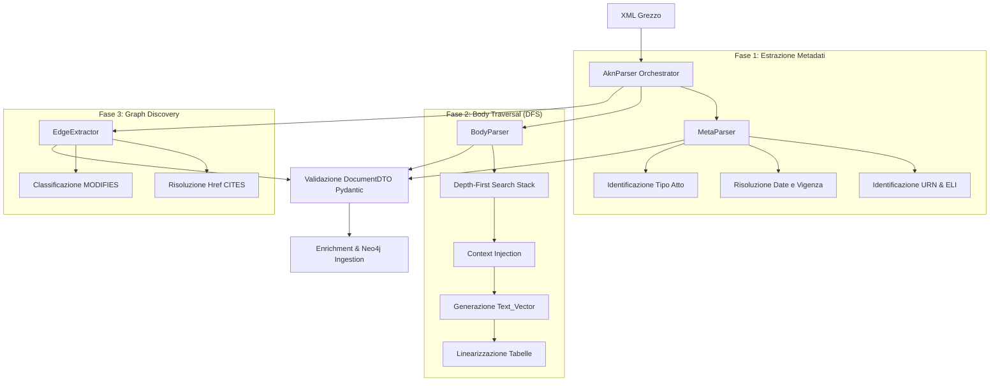

# 📄 Documentazione Tecnica Avanzata: Modulo Parser

Il modulo Parser è l'architetto del Knowledge Graph di **Legal GraphRAG**. È stato progettato per estrarre il massimo livello di informazione strutturale e semantica dai documenti legali italiani nei formati XML (Akoma Ntoso e NIR).

Questa documentazione fornisce un'analisi profonda del codice, degli algoritmi e dei design pattern implementati.

---

## 🏗️ Architettura del Sistema

Il sistema si articola come una pipeline deterministica in tre fasi, orchestrata dalla classe principale `AknParser` (in `src/parsing/parser.py`).



---

## 📊 Data Model (Pydantic V2)

Tutti i dati prodotti dal parser vengono validati strettamente tramite modelli definiti in `src/parsing/models.py`. Questo garantisce che nessun dato malformato raggiunga il database.

### 1. Il `DocumentDTO`
Rappresenta l'astrazione di interscambio per un singolo documento legislativo.
```python
class DocumentDTO(BaseModel):
    frbr: FRBRMetadata
    nodes: list[GraphNodeDTO] = Field(default_factory=list)
    edges: list[GraphEdgeDTO] = Field(default_factory=list)
    judgements: list[JudgementDTO] = Field(default_factory=list)
```

### 2. Il `GraphNodeDTO`
Rappresenta un frammento dell'albero XML. Esistono due tipi di nodi (`NodeType`):
- `STRUCTURAL`: (es. `libro`, `titolo`, `articolo`). Fungono da contenitori.
- `EXPRESSION`: (es. `comma`, `alinea`). Contengono il testo effettivo.

Campi fondamentali:
- `id`: Generato deterministicamente combinando la URN e l'eId XML tramite SHA-256 (es. `hash(urn:nir:stato:legge:2024-01-11;2#art_1)`).
- `text_display`: Testo renderizzato per la visualizzazione all'utente (Mantiene la formattazione).
- `text_vector`: Testo **iniettato col contesto** (vedi sezione sotto), ottimizzato esclusivamente per i modelli di embedding.

### 3. Le Relazioni `GraphEdgeDTO`
- `PART_OF`: Gestisce l'albero gerarchico (Comma 1 `PART_OF` Articolo 1).
- `NEXT`: Collega nodi fratelli per mantenere l'ordinamento (Comma 1 `NEXT` Comma 2).
- `CITES`: Relazioni estratte dai tag `<ref>` e `<rref>`.
- `MODIFIES`: Relazioni estratte dai tag `<mod>`, corredate dal tipo di novella normativa (Sostituzione, Abrogazione, Inserimento).

---

## 🧠 Algoritmo di Context Injection (BodyParser)

Nei tradizionali sistemi RAG (Retrieval-Augmented Generation), i documenti vengono semplicemente "tagliati" a chunk di N token. Nel dominio legale, questo è disastroso. Un chunk con il testo "Il termine è di 30 giorni" non significa nulla se separato dal suo Articolo e Titolo.

**Soluzione: Depth-First Search con Context Stack**

Il `BodyParser` attraversa l'XML in modalità DFS.
1. Ogni volta che entra in un nodo `STRUCTURAL` (es. `titolo`, `capo`, `articolo`), l'intestazione ("Titolo I", "Capo II", "Articolo 5") viene aggiunta in un array `context_stack`.
2. Ogni volta che incontra un nodo `EXPRESSION` (es. `comma`), genera la proprietà `text_vector` concatenando il `context_stack` attuale con il contenuto testuale.

**Esempio di output generato:**
```text
Costituzione > Parte II > Titolo I > Sezione II > Articolo 72 > Comma 1:
Ogni disegno di legge, presentato ad una Camera è, secondo le norme del suo regolamento, esaminato da una commissione e poi dalla Camera stessa...
```
*Questo approccio trasforma un testo semanticamente povero in un "vettore ricco", migliorando drammaticamente i punteggi di Cosine Similarity su query complesse.*

### Gestione delle Tabelle
Le tabelle XML sono un punto debole per i classici RAG. Il `BodyParser` implementa una linearizzazione speciale:
- Per l'interfaccia utente: Costruisce una tabella in Markdown (memorizzata in `text_display`).
- Per l'Embedding: Traduce la tabella in coppie riga-colonna `[Colonna: Valore]`, accodate al `text_vector`.

---

## 🔍 Edge Extractor: Citazioni e Modifiche Inline

Il file `edge_extractor.py` scansiona i nodi `EXPRESSION` cercando riferimenti.

### Risoluzione Href (`_resolve_href`)
La norma italiana è complessa. Un tag `<ref href="#art2">` (Riferimento interno) deve essere risolto nella URN completa del documento target, per trasformarsi da un ancoraggio HTML locale a un **identificativo globale** di nodo nel Knowledge Graph (ID generato da `urn` + `fragment`). Se invece inizia per `urn:nir:` o `/akn/`, viene considerato riferimento esterno.

### Classificazione delle Novelle Legislative
Un blocco `<mod>` indica che l'Atto sta modificando un'altra norma. L'estrattore usa espressioni regolari (Regex) sul testo italiano circostante per classificare il tipo di modifica e assegnare un'etichetta semantica in Neo4j.
```python
_SUBSTITUTION_PATTERN = re.compile(r"sostitu[it]|rimpiazzat|è\s+così\s+modifica", re.IGNORECASE)
_INSERTION_PATTERN = re.compile(r"inserit|aggiunt|dopo\s+...", re.IGNORECASE)
_REPEAL_PATTERN = re.compile(r"abrogat|soppress|eliminat", re.IGNORECASE)
```

---

## 🏷️ Arricchimento Semantico (TESEOMatcher)

Prima di caricare il `DocumentDTO` in Neo4j, il testo attraversa il `TESEOMatcher` (in `transformers.py` e `teseo_matcher.py`).

1. **Aho-Corasick Automaton**: Inizializza una macchina a stati finiti con tutti i `prefLabel` e `altLabel` estratti dallo standard RDF/SKOS del Thesaurus TESEO del Senato della Repubblica.
2. **Matching $O(n)$**: A differenza delle normali regex che scalerebbero male su migliaia di vocaboli per ogni chunk, Aho-Corasick scansiona il testo in tempo lineare.
3. **Controllo Confini**: L'algoritmo controlla `is_start_boundary` e `is_end_boundary` basati su caratteri alfanumerici per prevenire falsi positivi (impedendo, ad esempio, che il concetto "sole" venga matchato all'interno della parola "console").
4. **Scoring Coseno**: Una volta trovato il match testuale esatto, il matcher utilizza il `VectorEngine` (Ollama) per calcolare la distanza Coseno tra il contesto del testo e il termine stesso, impostando un punteggio allo spigolo `:HAS_TOPIC`.

---

## 🛡️ Gestione Eccezioni e Resilienza

- **Fallback XML Parsing**: Se `lxml` fallisce la validazione su errori di codifica (molto comuni in vecchi file del Senato), l'`AknParser` ricarica in memoria il file in `latin-1` e forza la transcodifica a UTF-8 in "best-effort".
- **Identificativi Sicuri**: Se un file manca dello standard URN, viene generato un hash MD5 fallback `urn:fallback:{hash}` basato sul nome file per prevenire crash a valle nel database grafico.
- **Allegati**: Se il parser incontra il tag `<attachments>`, avvia un'istanza ricorsiva di se stesso per processare l'allegato come documento subordinato.
