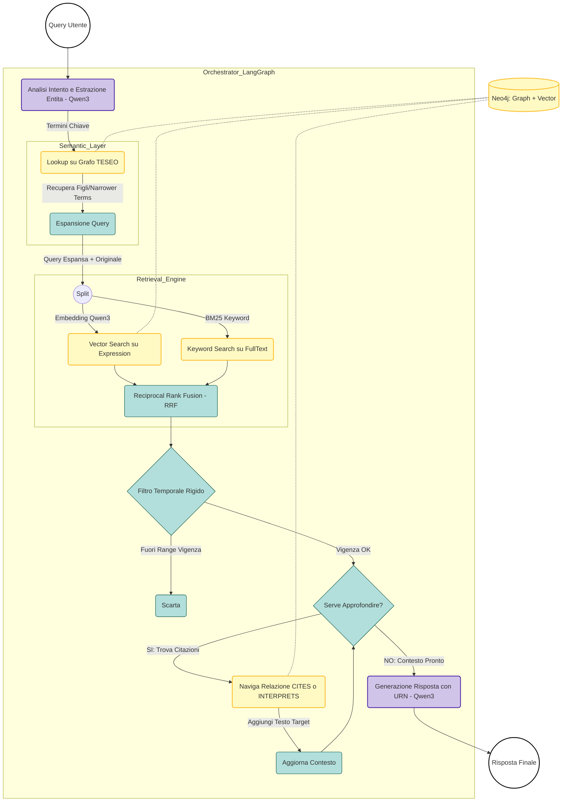
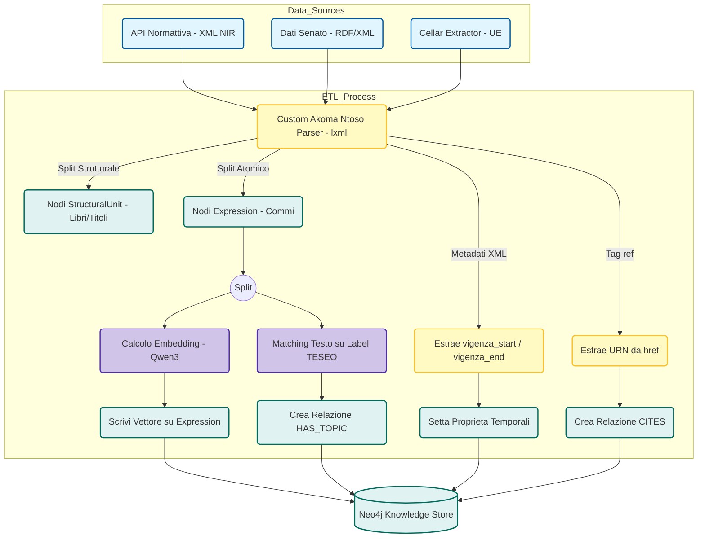
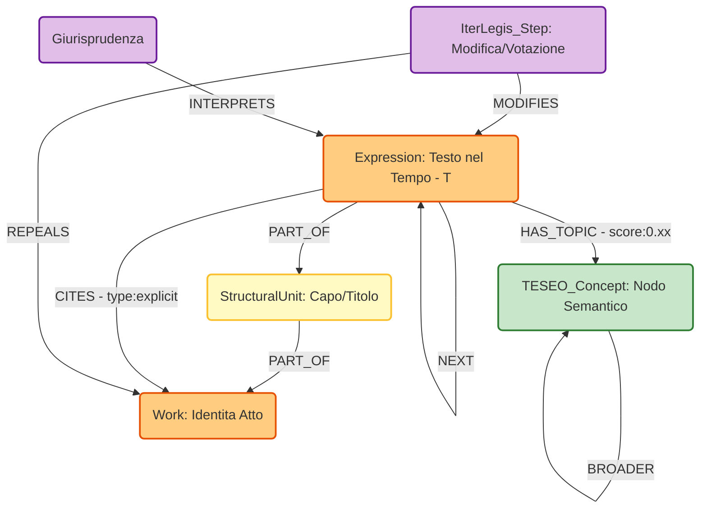

## 1. Architettura di Sistema

L'architettura segue il pattern **Hybrid Knowledge Graph + Vector Search**. Non esiste separazione tra database relazionale e vettoriale: **Neo4j** ospita nodi, relazioni e indici vettoriali.

### Componenti Macro
1.  **Ingestion Layer (XML-Native):** Pipeline ETL specializzata nel parsing di XML (Akoma Ntoso) e RDF, abbandonando approcci OCR/Unstructured per garantire precisione strutturale al 100%.
2.  **Knowledge Store:** Neo4j configurato per gestire il grafo delle norme e gli indici vettoriali (`Vector Index`) sui nodi foglia.
3.  **Semantic Layer:** Integrazione del Thesaurus **TESEO** (SKOS) per l'espansione semantica delle query e la classificazione dei contenuti.
4.  **Retrieval Engine:** Motore ibrido (BM25 + Vector) con logica di *Query Expansion* basata su ontologia e *Reranking* (RRF).
5.  **Orchestrator:** **LangGraph** per la gestione di flussi ciclici, mantenimento dello stato e navigazione multi-hop del grafo.
6.  **Generation Layer:** LLM Small Language Model (SLM) ottimizzato per reasoning legale e output strutturato.

---

## 2. Stack Tecnologico Definitivo

| Ambito             | Tecnologia                    | Motivazione / Configurazione                                                                                                    |
| :----------------- | :---------------------------- | :------------------------------------------------------------------------------------------------------------------------------ |
| **Database**       | **Neo4j**                     | Gestione nativa ibrida (Graph + Vector). Supporto Cypher per query complesse su relazioni temporali.                            |
| **Orchestration**  | **LangGraph**                 | Gestione di `StateGraph` ciclici necessari per il retrieval ricorsivo e la navigazione delle citazioni.                         |
| **LLM Framework**  | **LangChain** (Python)        | Astrazione per interazione modelli e parsing output (Pydantic).                                                                 |
| **LLM Inference**  | **Qwen3:4b**                  | Fine-tuned (QLoRA) per output JSON, reasoning temporale e entity resolution. Quantizzazione ibrida (4-bit backbone, FP16 head). |
| **Embedding**      | **Qwen3 Embedding**           | Supporto context window 32k per evitare frammentazione semantica.                                                               |
| **Reranking**      | **BGE-Reranker-v2**           | Riordinamento candidati post-retrieval.                                                                                         |
| **Parsing / ETL**  | **Custom Akoma Ntoso Parser** | Parser XML (basato su `lxml`) per estrazione deterministica di struttura e metadati. Sostituisce *Unstructured.io*.             |
| **Data Standards** | **Akoma Ntoso / NIR**         | Standard XML per la struttura documentale e URN per il naming univoco.                                                          |
| **Semantica**      | **SKOS (TESEO)**              | Standard W3C per l'importazione del thesaurus del Senato.                                                                       |
| **EU Data**        | **cellar-extractor**          | Libreria Python per estrazione dati da EUR-Lex (SPARQL endpoint).                                                               |

---

## 4. Ontologia e Data Model

Il modello dati adotta lo standard **FRBR (Functional Requirements for Bibliographic Records)** adattato al dominio legale italiano, integrando le ontologie istituzionali (OCD, TESEO).

### 4.1 Nodi (Entities)

| Label Nodo | Mapping Standard | Descrizione e Proprietà Chiave |
| :--- | :--- | :--- |
| `:Work` | FRBR Work | L'identità astratta dell'atto. <br> **Props:** `urn` (URN:NIR), `official_id`, `promulgation_date`. |
| `:Expression` | FRBR Expression | La versione del testo in un intervallo temporale $T$. Target del Vector Search. <br> **Props:** `text_content`, `embedding`, `vigenza_start`, `vigenza_end` (da API Normattiva). |
| `:StructuralUnit` | Akoma Ntoso | Contenitori gerarchici (Libro, Titolo, Capo, Articolo). <br> **Props:** `heading`, `order_index`, `unit_type`. |
| `:IterLegis_Step` | OCD Ontology | Evento dell'iter parlamentare o modifica. <br> **Props:** `type` (VOTAZIONE, ASSEGNAZIONE), `date`, `authority`. |
| `:TESEO_Concept` | SKOS Concept | Nodo semantico dal Thesaurus del Senato. <br> **Props:** `prefLabel`, `altLabel`, `embedding`, `broader_concept_id`. |

### 4.2 Relazioni (Relationships)

*   **Strutturali:** `(:Expression)-[:PART_OF]->(:StructuralUnit)-[:PART_OF]->(:Work)`
*   **Sequenziali:** `(:Expression)-[:NEXT]->(:Expression)` (Scorrimento commi).
*   **Citazionali:** `(:Expression)-[:CITES {type: "explicit", ref_urn: "..."}]->(:Work)`
    *   Da verificare se possibile popolarlo deterministicamente con parsing dei tag `<ref>` dell'XML Akoma Ntoso.
*   **Semantiche:** `(:Expression)-[:HAS_TOPIC {score: 0.xx}]->(:TESEO_Concept)`
*   **Evolutive:** `(:IterLegis_Step)-[:MODIFIES]->(:Expression)` o `(:IterLegis_Step)-[:REPEALS]->(:Work)`
*   **Interpretative:** `(:Giurisprudenza)-[:INTERPRETS {orientamento: "conforme"}]->(:Expression)`

---

## 5. Pipeline di Ingestion (ETL)


### Fase 1: Acquisizione Dati (Source Strategy)
*   **Legislazione:** API Asincrona Normattiva (Endpoint 2026). Download XML (NIR).
*   **Parlamento:** Bulk download RDF/XML da `dati.senato.it` (Cold Start) e SPARQL su `dati.camera.it` (Aggiornamenti (Verficare anche se fattibile a runtime)).
*   **Giurisprudenza:** Open Data Corte Costituzionale (XML) + Convenzione BDP/SentenzeWeb.
*   **UE:** `cellar-extractor` su EUR-Lex.

### Fase 2: Native XML Parsing & Splitting
Utilizzo di parser custom per Akoma Ntoso.
1.  **Structure-Aware Splitting:** Il parser identifica i tag `<article>`, `<clause>` (comma), `<list>` (lettere).
2.  **Atomic Units:** Ogni unità minima di senso (es. un comma) diventa un nodo `:Expression`.
3.  **Metadata Extraction:** Estrazione diretta di `vigenza_start` e `vigenza_end` dai metadati XML.
4.  **Citation Extraction:** Estrazione attributi `href` dai tag `<ref>` per creare archi `:CITES` immediati.
>è da verificare se è possibile evitare l'llm in questa fase
### Fase 3: Parent-Child Indexing & Enrichment
1.  **Embedding:** Calcolato *solo* sui nodi foglia (`:Expression` di un comma).
2.  **Linking:** Il nodo foglia è collegato al padre (`:StructuralUnit` Articolo).
3.  **TESEO Linking:**
    *   Matching esatto/fuzzy tra testo della norma e `prefLabel/altLabel` dei nodi `:TESEO_Concept`.
    *   Creazione arco `:HAS_TOPIC`.

### Fase 4: Offline Community Detection
*   Esecuzione periodica algoritmo **Leiden** su Neo4j.
*   Generazione embedding di cluster per migliorare il retrival (Da valutare)
*   Generazione riassunti dei cluster per risposte a domande macroscopiche.

---

## 6. Workflow di Retrieval e Query (Runtime)

Gestito da **LangGraph**.

### Step 1: Query Analysis & TESEO Expansion
1.  **Intent Classification:** LLM identifica se la query è fattuale, comparativa o giurisprudenziale.
2.  **Concept Mapping:** Estrazione entità e lookup sul grafo `:TESEO_Concept`.
3.  **Expansion:** Recupero dei *Narrower Terms* (concetti figli) dal grafo TESEO.
    *   *Esempio:* Query "Incentivi solare" -> TESEO trova "Energia Solare" -> Espande a "Fotovoltaico", "Conto Energia".
    *   La ricerca vettoriale userà anche i termini espansi.

### Step 2: Hybrid Retrieval & RRF
Esecuzione parallela:
1.  **Vector Search:** Cosine similarity su nodi `:Expression` (query utente + termini TESEO). Peso: **0.8x**.
2.  **Keyword Search (BM25):** Su indici Full-Text (priorità a numeri articoli, es. "Art. 2043"). Peso: **1.5x**.
3.  **Fusion:** Algoritmo **Reciprocal Rank Fusion (RRF)** pesato.

### Step 3: Temporal Filtering (Hard Filter)
Applicazione filtro SQL-like sui metadati estratti dall'XML:
```cypher
WHERE node.vigenza_start <= query_date 
AND (node.vigenza_end IS NULL OR node.vigenza_end >= query_date)
```

### Step 4: Recursive Graph Traversal (Multi-hop)
Se i nodi recuperati hanno archi `:CITES` o `:INTERPRETS` rilevanti:
1.  Navigazione dell'arco per recuperare il nodo target (la norma citata).
2.  Inclusione del testo target (e della struttura) nella Context Window 

### Step 5: Generation
L'LLM genera la risposta citando le fonti con URN canonici.

---

## 7. Dettagli Tecnici e Implementativi

### 7.1 Fine-Tuning (SFT con QLoRA)
Modello Base: **Qwen3:4b**. Dataset sintetici focalizzati su:
1.  **Structured Output:** JSON (Sorgente -> Relazione -> Destinazione).
2.  **Temporal Reasoning:** Deduzione data di riferimento se implicita (es. "normativa vigente l'anno scorso").
3.  **URN Resolution:** Mapping da linguaggio naturale ("Legge Fornero") a URN:NIR.

### 7.2 Gestione Errori e Fallback
*   **Missing Data:** Se la ricerca vettoriale fallisce (score < soglia), fallback su ricerca pura Keyword (BM25) su `:TESEO_Concept` per suggerire argomenti correlati all'utente.
*   **Hallucination Check:** Verifica che ogni URN citato nella risposta esista nella lista dei documenti recuperati (`retrieved_context`).

---

## 8. Fonti Dati e Endpoint (Riepilogo Operativo)

| Tipologia           | Fonte           | Endpoint / Metodo                              | Formato    |
| :------------------ | :-------------- | :--------------------------------------------- | :--------- |
| **Leggi Statali**   | Normattiva      | `POST /api/v1/ricerca-asincrona/nuova-ricerca` | XML (NIR)  |
| **Atti Senato**     | Dati Senato     | `dati.senato.it/sito/scarica_i_dati` (Bulk)    | RDF / XML  |
| **Thesaurus**       | Senato          | `dati.senato.it/sparql` (TESEO)                | SKOS / RDF |
| **Votazioni/Iter**  | Camera          | `dati.camera.it/sparql`                        | RDF (OCD)  |
| **Corte Cost.**     | Corte Cost.     | `dati.cortecostituzionale.it`                  | XML / JSON |
| **Sentenze Merito** | BDP / Giustizia | Convenzione API o `SentenzeWeb`                | PDF / XML  |
| **Norme UE**        | EUR-Lex         | `cellar-extractor` (Python Lib)                | RDF / HTML |

---

### 1. Workflow di Runtime (Hybrid Retrieval con Espansione TESEO)

Questo diagramma evidenzia l'integrazione del Thesaurus TESEO per espandere la query prima della ricerca e il filtro temporale rigido.



---

### 2. Pipeline di Ingestion (ETL XML-Native)

Qui il focus è sull'abbandono dell'OCR/Unstructured in favore del parsing XML (Akoma Ntoso) e sull'estrazione deterministica dei metadati.




---

### 3. Data Model (Ontologia FRBR + TESEO)

Questo diagramma mostra come sono modellati i dati in Neo4j, evidenziando la separazione tra l'atto astratto (`Work`) e il testo vigente (`Expression`), oltre ai collegamenti semantici.





### Note sui Diagrammi per l'Implementazione

- **Expansion (Diagramma 1):** Nota come il blocco "TeseoLookup" avvenga _prima_ della ricerca vettoriale. Questo è fondamentale: se l'utente cerca "bonus facciate", TESEO aggiunge "detrazioni fiscali edilizie" al contesto della ricerca vettoriale.
    
- **Parser Custom (Diagramma 2):** Ho rimosso ogni riferimento a Unstructured.io o OCR. Tutto parte dal parser `lxml` che legge la struttura ad albero dell'XML.
    
- **Nodi Expression (Diagramma 3):** È il nodo più importante. Contiene il testo (`text_content`), il vettore (`embedding`) e le date (`vigenza_start/end`). È l'unico nodo su cui viene eseguita la `Vector Search`.