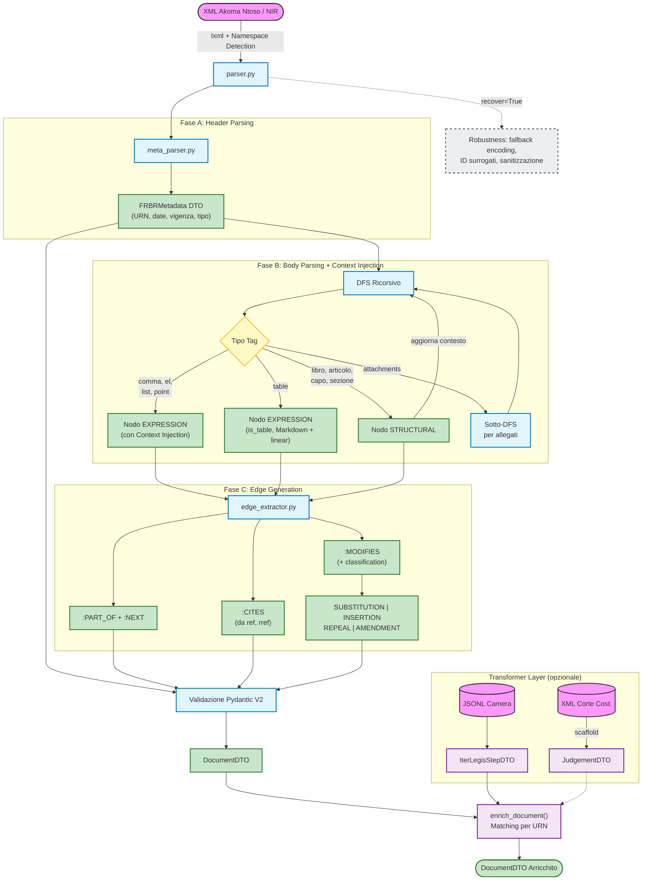

```mermaid
graph TD
    %% Stili
    classDef input fill:#f9f,stroke:#333,stroke-width:2px;
    classDef process fill:#e1f5fe,stroke:#0277bd,stroke-width:2px;
    classDef decision fill:#fff9c4,stroke:#fbc02d,stroke-width:2px;
    classDef output fill:#c8e6c9,stroke:#2e7d32,stroke-width:2px;
    classDef storage fill:#eceff1,stroke:#455a64,stroke-width:2px,stroke-dasharray: 5 5;
    classDef enrichment fill:#f3e5f5,stroke:#7b1fa2,stroke-width:2px;

    %% Input
    Start([XML Akoma Ntoso / NIR]) -->|"lxml + Namespace Detection"| Parser["parser.py"]
    class Start input
    class Parser process

    %% Robustness
    Parser -.->|recover=True| Robust["Robustness: fallback encoding,<br/>ID surrogati, sanitizzazione"]
    class Robust storage

    %% FASE A
    subgraph PhaseA ["Fase A: Header Parsing"]
        MetaParse["meta_parser.py"] --> FRBR["FRBRMetadata DTO<br/>(URN, date, vigenza, tipo)"]
    end
    Parser --> MetaParse
    class MetaParse process
    class FRBR output

    %% FASE B
    subgraph PhaseB ["Fase B: Body Parsing + Context Injection"]
        DFS["DFS Ricorsivo"] --> TagType{"Tipo Tag"}
        TagType -->|"libro, articolo,<br/>capo, sezione"| StructNode["Nodo STRUCTURAL"]
        TagType -->|"comma, el,<br/>list, point"| ExprNode["Nodo EXPRESSION<br/>(con Context Injection)"]
        TagType -->|"table"| TableNode["Nodo EXPRESSION<br/>(is_table, Markdown + linear)"]
        TagType -->|"attachments"| AttNode["Sotto-DFS<br/>per allegati"]
        StructNode -->|aggiorna contesto| DFS
        AttNode --> DFS
    end
    FRBR --> DFS
    class DFS process
    class TagType decision
    class StructNode,ExprNode,TableNode output
    class AttNode process

    %% FASE C
    subgraph PhaseC ["Fase C: Edge Generation"]
        Edges["edge_extractor.py"]
        Edges --> PartOf[":PART_OF + :NEXT"]
        Edges --> Cites[":CITES<br/>(da ref, rref)"]
        Edges --> Modifies[":MODIFIES<br/>(+ classification)"]
        Modifies --> ModTypes["SUBSTITUTION | INSERTION<br/>REPEAL | AMENDMENT"]
    end
    ExprNode --> Edges
    TableNode --> Edges
    StructNode --> Edges
    class Edges process
    class PartOf,Cites,Modifies,ModTypes output

    %% Validazione
    FRBR --> Validate
    PartOf --> Validate
    Cites --> Validate
    ModTypes --> Validate
    Validate["Validazione Pydantic V2"] --> DocDTO["DocumentDTO"]
    class Validate process
    class DocDTO output

    %% Transformer Layer
    subgraph TransLayer ["Transformer Layer (opzionale)"]
        CameraIn[("JSONL Camera")] --> IterDTO["IterLegisStepDTO"]
        CorteIn[("XML Corte Cost.")] -->|scaffold| JudgeDTO["JudgementDTO"]
    end
    class CameraIn,CorteIn input
    class IterDTO,JudgeDTO enrichment

    DocDTO --> Enrich["enrich_document()<br/>Matching per URN"]
    IterDTO --> Enrich
    JudgeDTO -.-> Enrich
    Enrich --> FinalDTO(["DocumentDTO Arricchito"])
    class Enrich enrichment
    class FinalDTO output
```
