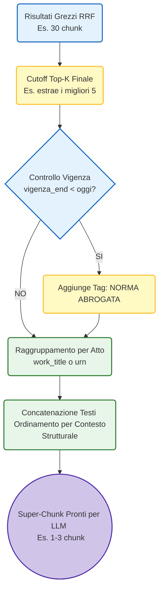

# Fase 6: Ottimizzazione Pipeline RAG (Vigenza, Cutoff e Merging)

In questa fase, l'obiettivo è stato il raffinamento e la condensazione dell'output generato dal Retrieval Engine. Abbiamo ottimizzato il contesto estratto per renderlo ideale all'ingestione da parte di un LLM (fase di Generazione), prevenendo la saturazione della context window e le allucinazioni causate da testi normativi abrogati.

## Architettura del Processo di Fusione

L'ottimizzazione interviene nello step finale del nodo di Retrieval, subito dopo l'algoritmo di **Reciprocal Rank Fusion (RRF)**. Di seguito il flusso logico implementato:



---

## Dettaglio delle Attività Svolte

### 1. Implementazione Cutoff e Reranking (Top-K Finale)
- **Problema**: Fornire decine di risultati a un LLM porta a superare i limiti di token e induce il fenomeno del *"Lost in the Middle"*, dove il modello ignora le informazioni centrali.
- **Logica a due stadi (`top_k` vs `final_k`)**: Abbiamo modificato `RagState` in `src/rag/models.py` separando i concetti. Il parametro `top_k` (default: 10) definisce quanti documenti estrarre *per singolo canale* (Vector, BM25, Graph), portando a circa 30 risultati grezzi. Il parametro `final_k` (default: 5) rappresenta il limite rigido applicato in `src/rag/fusion.py` al termine della fusione RRF.
- **Risultato**: Il sistema valuta un vasto bacino di documenti, ma isola unicamente l'élite dei risultati (i migliori 5 frammenti in assoluto) da passare all'LLM.

### 2. Gestione Esplicita della Vigenza (Marcatura Abrogazioni)
- **Problema**: Nel dominio legale, omettere lo stato di validità di una norma induce l'LLM a fornire pareri errati basati su leggi passate. D'altro canto, filtrare e nascondere completamente le norme storiche impedisce le analisi di tipo retroattivo.
- **Tagging Dinamico**: In `src/rag/fusion.py` è stata introdotta la funzione `_mark_abrogated_chunks`. Questa funzione cicla sui chunk estratti e confronta il campo `vigenza_end` con la data della query.
- **Trasparenza Semantica**: Qualora una norma risulti storicizzata, viene anteposto dinamicamente e obbligatoriamente il tag testuale `[ATTENZIONE: NORMA ABROGATA]` al contenuto testuale del frammento. L'LLM riceve così un'istruzione inequivocabile sul ciclo di vita della norma esaminata.

### 3. Merging Strutturale dei Frammenti (De-frammentazione)
- **Problema**: Recuperare frammenti isolati appartenenti allo stesso Atto Normativo (es. Art. 16-bis, Art. 25 e Art. 43 del medesimo regolamento) frammenta il contesto semantico e peggiora la comprensione globale del documento da parte dell'LLM.
- **Grouping per Atto**: La nuova funzione `_merge_chunks` intercetta, all'interno dei Top-K finali, i frammenti che condividono lo stesso attributo madre (identificato tramite `work_title` o, in assenza, `work_urn`).
- **Super-chunking**: I frammenti correlati vengono ordinati in base al `structural_context` (garantendo l'ordine cronologico o logico interno della legge) e poi aggregati in un unico "super-chunk" sequenziale. I testi sono separati dal delimitatore `--- articolo --- X`. Il super-chunk eredita il punteggio di rilevanza più alto (`max_score`) tra i frammenti che lo compongono, ricevendo uno speciale ID identificativo (`merged_XXXX`).

---

## Modifiche al Codice Base

L'implementazione ha richiesto modifiche trasversali all'Engine:
- **`src/rag/models.py`**: Aggiunta del campo `final_k: int` allo stato LangGraph (`RagState`).
- **`src/rag/engine.py`**: Modifica della firma di `RagEngine.retrieve()` per accettare `final_k` e propagarlo nello stato iniziale per i nodi del grafo.
- **`src/rag/fusion.py`**: Refactoring del nodo di fusione `fuse_and_filter`. Sostituzione del vecchio filtro temporale distruttivo con `_mark_abrogated_chunks`, applicazione dello slicing (`[:final_k]`) e inserimento di `_merge_chunks`.
- **`manage.py`**: Aggiornamento del parser CLI con l'aggiunta dell'argomento `--final-k`. Inserimento della libreria `textwrap` per gestire l'avvolgimento a riga fissa (120 caratteri) dell'output nel terminale, risolvendo bug visivi legati a lunghe stringhe consecutive di blocchi "super-chunked".

---

## Comandi per la Verifica

### 1. Esecuzione Retrieval con Cutoff Aggressivo
Il seguente comando estrae 10 documenti per canale, ma ne mantiene solo 3 dopo l'algoritmo di fusione e ne opera il merging strutturale:

```bash
docker compose run --rm data-app python manage.py retrieve --query "bilancio dello stato" --verbose --top-k 10 --final-k 3
```

### 2. Output Atteso
- La CLI restituirà la dicitura `RISULTATI RETRIEVAL IBRIDO (X chunk)` dove `X` sarà inevitabilmente minore o uguale a `final_k`.
- I chunk che hanno subito una fusione riporteranno come `ID Nodo:` un id preceduto dal prefisso `merged_` (es. `merged_816ed765571918f8`).
- All'interno del campo `Testo:`, sarà visibile la concatenazione di più porzioni normative della stessa fonte, chiaramente suddivise dai delimitatori.
- Le norme la cui data di fine validità risulta antecedente a quella odierna presenteranno il prefisso di avviso abrogazione.
