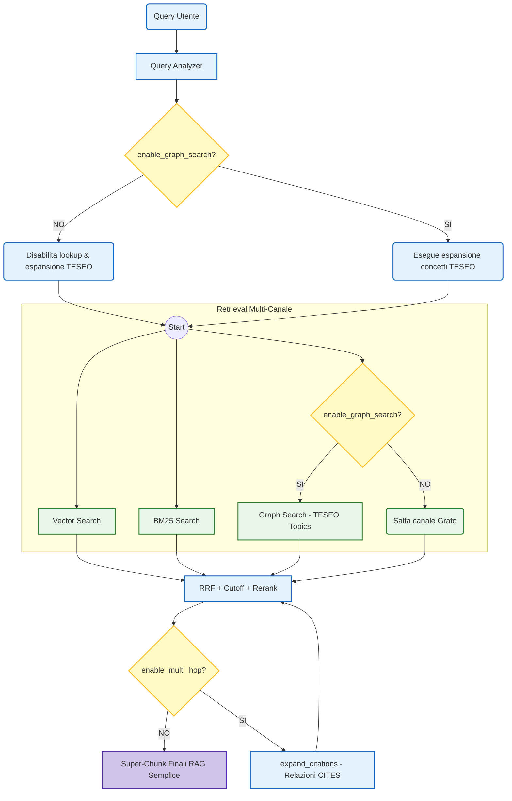

# Fase 7: Studio di Ablazione e Configurazione Modelli


In questa fase, l'obiettivo è strutturare la metodologia per isolare il contributo del Knowledge Graph rispetto al RAG tradizionale (Studio di Ablazione) e risolvere i blocchi di caricamento riscontrati a runtime per i modelli di Reranking ed Embedding.

---

## Architettura del Processo di Ablazione (RAG vs GraphRAG)

Per valutare l'efficacia del Knowledge Graph a parità di base di dati in Neo4j, introduciamo un meccanismo di controllo a flag che permette di disattivare selettivamente la ricerca semantica basata sull'ontologia TESEO e l'espansione multi-hop delle citazioni.



---

## Dettaglio delle Attività da Svolgere

### 1. Configurazione Modelli e Risoluzione Bug
- **Errore Modello Reranker**: 
  - **Problema**: L'identificativo `"Qwen3-Reranker-0.6B"` inserito in `src/config.py` genera un errore 401 su Hugging Face poiché `sentence-transformers` assume per default l'organizzazione `cross-encoder/` (cercando `cross-encoder/Qwen3-Reranker-0.6B`).
  - **Soluzione**: Sostituire con il repository ufficiale **`Qwen/Qwen3-Reranker-0.6B`**. Il modello è pienamente compatibile con `CrossEncoder` poiché provvisto di configurazioni recenti (`modules.json`, `chat_template.jinja`) per gestire l'architettura decoder-only (Causal LM).
- **Errore Modello Embedding**:
  - **Problema**: Mancanza del modello locale in Ollama, che causa il fallimento silenzioso del Vector Search con conseguente skip del canale vettoriale.
  - **Soluzione**: Eseguire il pull locale del modello prima di testare il retrieval.

### 2. Implementazione dei Flag nel Grafo (`RagState` & `RagEngine`)
- **Modifiche allo Stato**: Aggiungere i campi booleani `enable_graph_search` ed `enable_multi_hop` nel dizionario `RagState` in [src/rag/models.py](file:///c:/Users/gabri/APP/Universit%C3%A0/Tesi/src/rag/models.py).
- **Modifiche ai Nodi del Grafo**:
  - **`analyze_query`**: Condizionare la chiamata a `_expand_teseo_concepts` e l'accodamento delle label alla query in base a `enable_graph_search`.
  - **`retrieve_all`**: Saltare la funzione `graph_search` (restituendo un dizionario con lista vuota) se `enable_graph_search` è impostato a `False`.
  - **`should_expand`**: Se `enable_multi_hop` è `False`, forzare il routing diretto a `__end__` bypassando l'attraversamento ricorsivo delle citazioni.

### 3. Setup del Sandbox Notebook per la Valutazione
- Configurazione di una cella comparativa in [legal_sandbox.ipynb](file:///c:/Users/gabri/APP/Universit%C3%A0/Tesi/legal_sandbox.ipynb) che esegue lo stesso set di query in entrambe le modalità:
  1. **RAG Semplice** (`enable_graph_search=False` ed `enable_multi_hop=False`).
  2. **GraphRAG** (`enable_graph_search=True` ed `enable_multi_hop=True`).
- Formattazione side-by-side dei risultati estratti (Score RRF, Fonte, Atto, Contesto Strutturale e porzioni di testo) per valutare l'impatto qualitativo del grafo sui risultati.

---

## Comandi per la Verifica e il Setup

### 1. Download locale dei Modelli
Assicurarsi che il modello di embedding sia presente in Ollama:
```bash
docker compose exec ollama ollama pull qwen3-embedding:0.6b
```

### 2. Esecuzione dei Test Comparativi (Jupyter Notebook)
All'interno del notebook, la validazione si eseguirà come segue:

```python
# 1. Configurazione Engine
from src.rag.engine import RagEngine
engine = RagEngine()

# 2. Esecuzione RAG Semplice (Solo Vettoriale + BM25)
chunks_simple = await engine.retrieve(
    query="Quali sono le competenze delle regioni?", 
    enable_graph_search=False, 
    enable_multi_hop=False
)

# 3. Esecuzione GraphRAG (Vettoriale + BM25 + Grafo TESEO + Citazioni Multi-hop)
chunks_graphrag = await engine.retrieve(
    query="Quali sono le competenze delle regioni?", 
    enable_graph_search=True, 
    enable_multi_hop=True
)
```
