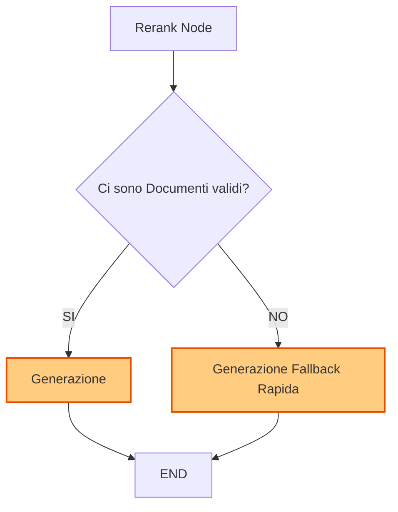

# Fase 8: Sviluppo Generatore, Integrazione Grafo e Memoria Conversazionale


## 8A - Sviluppo del Generatore e Prompt Engineering
Questa fase rappresenta lo sviluppo isolato del componente di Generazione (il `LegalGenerator`). Affinché un sistema RAG (e GraphRAG) sia affidabile, non basta un buon retrieval: il LLM deve essere vincolato rigidamente ai documenti forniti, senza inventare informazioni, e deve citare sempre le fonti.

### 1. Architettura della Classe `LegalGenerator`
La classe, da implementare in `src/rag/generator.py`, dovrà occuparsi esclusivamente dell'interfacciamento con il LLM per la sintesi finale.

**Responsabilità:**
- Ricevere la `query` dell'utente e la lista di `Document` (chunk) recuperati.
- Formattare i documenti in un blocco di testo strutturato (es. includendo `ID_Fonte` e `Testo`).
- Costruire i prompt di sistema e utente.
- Restituire la risposta generata (eventualmente in streaming, tramite generatori asincroni).

### 2. Strategia di Prompt Engineering
Il prompt dovrà seguire il pattern della **Grounded Generation**. 
*   **System Prompt:** Definirà il ruolo (es. "Sei un assistente legale esperto. Devi rispondere SOLO basandoti sui documenti forniti."). Conterrà istruzioni rigide su come comportarsi se l'informazione non è presente.
*   **User Prompt:** Conterrà il blocco di contesto formattato e la domanda dell'utente.
*   **Formato Citazioni:** Obbligare il LLM a usare formati specifici alla fine della frase, es. `[Nome Atto, Articolo X]`.

### 3. Ambiente di Test Isolato (Sandbox)
Per evitare chiamate inutili al database Neo4j e a Weaviate, si creerà un piccolo script di test o notebook in cui passeremo alla classe `LegalGenerator` un contesto mockato (fittizio).

**Esempio di Mock:**
```python
mock_chunks = [
    Document(page_content="L'art. 2 sancisce la libertà personale...", metadata={"source": "Costituzione", "art": "2"}),
    Document(page_content="Le pene non possono consistere in trattamenti contrari al senso di umanità.", metadata={"source": "Costituzione", "art": "27"})
]
```

### 4. Criteri di Accettazione (Acceptance Criteria)
1. **Zero-Hallucination Fallback:** Se la query è "Qual è la ricetta della pizza?" e i documenti parlano di legge, il modello DEVE rispondere in modo esplicito: "Non dispongo di informazioni sufficienti per rispondere a questa domanda."
2. **Accuratezza Citazionale:** Ogni affermazione nella risposta deve essere tracciabile a uno dei chunk mockati.
3. **Formattazione Pulita:** Nessun prologo ("Ecco la risposta:", "Certo,"). La generazione deve andare dritta al punto.

---

## 8B - Integrazione nel Grafo (LangGraph)
Questa fase consiste nel collegare il modulo sviluppato nella Fase 8A al cuore orchestrativo del progetto: il grafo LangGraph definito in `src/rag/engine.py`.

### 1. Modifica del `RagState`
In `src/rag/models.py`, lo stato condiviso tra i nodi dovrà accogliere i nuovi dati post-generazione.
```python
class RagState(TypedDict):
    # ... campi esistenti ...
    generation: Optional[str]  # Testo finale prodotto dal LLM
    # flag per lo streaming (opzionale)
```

### 2. Aggiunta del Nodo di Generazione
Definizione di un nuovo nodo asincrono `generate(state: RagState)` in `src/rag/engine.py` che:
1. Estrae i chunk finali dallo stato (dopo Reranking o espansione Multi-hop).
2. Istanzia/usa `LegalGenerator`.
3. Attende la risposta del LLM.
4. Aggiorna lo stato: `return {"generation": risposta}`.

### 3. Topologia del Grafo e Conditional Edges
Attualmente il grafo termina dopo il Retrieval o l'Espansione. Dobbiamo ridirezionare i flussi.



**Logica `should_generate`:**
- Se l'algoritmo di Reranking ha droppato tutti i documenti (perché gli score erano troppo bassi), il sistema salterà la vera generazione e compilerà direttamente lo stato con un messaggio prefissato (es. "Nessun documento rilevante trovato.").

### 4. Criteri di Accettazione (Acceptance Criteria)
1. **Flusso Completo:** Chiamando `engine.retrieve(query="...")` il sistema deve ora eseguire l'ingestione della query, recupero su DB, multi-hop, E restituire la risposta testuale formattata.
2. **Gestione del Vuoto:** Il grafo non deve generare eccezioni se le query non producono alcun match vettoriale/BM25.

---

## 8C - Memoria Conversazionale (Multi-turn)
Per rendere il sistema capace di dialogare fluidamente e mantenere il contesto (caratteristica essenziale prima di introdurre il Loop Agentico), implementeremo la gestione della Conversation History.

### Obiettivi
1. Modifica dello stato per memorizzare i turni di conversazione precedenti.
2. Inserimento di un nodo iniziale che riscrive la query dell'utente alla luce dello storico.

### Dettagli Implementativi
- **Aggiornamento `RagState`**: Aggiunta di un campo `chat_history: List[dict]` (es. liste di messaggi role-based: `user`, `assistant`).
- **Nodo `ContextualizeQuery`**:
  - Se la `chat_history` è vuota, passa la query così com'è.
  - Se è popolata, passa la history e la nuova query a un LLM per produrre una "Standalone Query". 
  *(Es: History: "Quali sono le competenze delle regioni?", Query: "E quelle dello Stato?" -> Standalone Query: "Quali sono le competenze dello Stato?").*
- **Flusso nel Grafo**: Questo nodo deve essere il primissimo step della pipeline LangGraph (ancora prima del Query Analyzer e dell'estrazione degli intenti TESEO), così tutto il resto del processo riceve una query chiara e indipendente.
