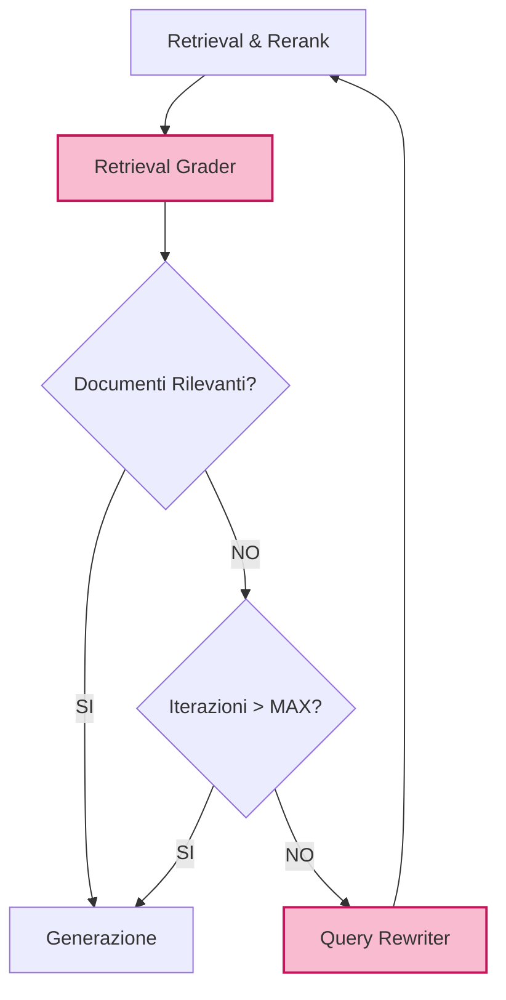

# Fase 9: Loop Agentico (Grader e Query Rewriter)


Il Loop Agentico (o Self-Reflective RAG) trasforma la pipeline da un processo lineare (Retrieval -> Generation) a un processo iterativo. Se il sistema "capisce" di non avere le risposte giuste o di aver sbagliato, ritenta.

---

## 1. Nodi di Valutazione (LLM-as-a-Judge)
Dovremo implementare due nuovi attori (basati su LLM, possibilmente modelli piccoli ed efficienti come Llama-3 8B o Qwen-14B).

### A. Retrieval Grader
Un nodo inserito DOPO il Reranking ma PRIMA della generazione.
- **Input:** Query originale + Lista di Documenti recuperati.
- **Output:** Score binario (`yes`/`no`).
- **Comportamento:** Se la maggioranza dei documenti top-k è irrilevante (`no`), scatta il reindirizzamento al Rewriter.

### B. Hallucination Grader (Opzionale/Fase successiva)
Un nodo inserito DOPO la Generazione.
- **Input:** Documenti recuperati + Generazione.
- **Output:** `yes` (sono ancorato ai documenti), `no` (sto allucinando).

## 2. Il Nodo Query Rewriter
Se il Retrieval Grader boccia i documenti, lo stato viene passato al nodo `rewrite_query`.
- **Logica:** Utilizza il LLM per riformulare semanticamente la query originale in modo da favorire Weaviate (o Neo4j).
- **Stato:** Aggiunge la nuova query a un campo `RagState["rewritten_queries"]`.

## 3. Gestione del Loop Infinito
Per evitare che il sistema entri in un ciclo di riformulazioni senza fine, lo stato deve tracciare il numero di tentativi.
```python
class RagState(TypedDict):
    # ...
    iterations: int
```
Nel router condizionale: `if state["iterations"] >= MAX_RETRIES: return "generate"` (forzando la generazione della risposta "Non lo so" usando i pochi documenti a disposizione).

## 4. Architettura del Grafo Aggiornata


## 5. Criteri di Accettazione
1. Il sistema dev'essere in grado di correggere query povere (es. "art 2" -> "Cosa dice l'articolo 2 della Costituzione in merito a...").
2. Il conteggio delle iterazioni deve funzionare e bloccare i loop dopo (es.) 3 tentativi.
